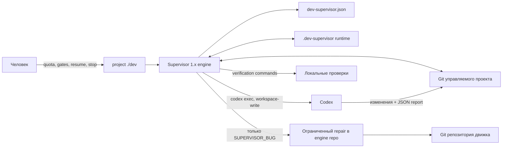

# Development Supervisor 1.x: архитектура AS-IS

Статус: **фактическое описание реализации** на коммите
`854083f51c9aedf33ec2d9654fc67aacff84af8a` от 2026-09-24.

Это описание основано на `supervisor.py`, launcher-скриптах, prompts, JSON schemas,
README, MIGRATION и 156 тестах. Оно не приписывает 1.x возможностей, которых нет в
коде. Ограничения и оценка сценариев вынесены в
[отдельный документ](limitations.ru.md).

## Назначение и граница системы

Supervisor 1.x — локальный консервативный оркестратор разработки одного Git-репозитория.
Он последовательно выдаёт Codex ровно один текущий тикет, проверяет структурированный
отчёт, запускает детерминированные проверки, контролирует допустимый набор файлов и
создаёт commit. Это один Python-файл, а не пакет, сервис, SDK или plugin framework
([README](../README.md), [MIGRATION](../MIGRATION.md)).

Движок и управляемый проект разделены физически:

- репозиторий движка владеет `supervisor.py`, `supervisor`, `prompts/`, `schemas/`,
  тестами и документацией;
- управляемый репозиторий владеет launcher-файлом `dev`, policy
  `dev-supervisor.json`, архитектурными документами, тикетами, продуктовым кодом и
  игнорируемым runtime-каталогом `.dev-supervisor/`;
- `dev` определяет путь к движку из `.dev-supervisor/engine.json` или переменной
  `DEV_SUPERVISOR_HOME`, передаёт путь проекта через `DEV_SUPERVISOR_PROJECT_ROOT` и
  запускает файл движка без копирования кода
  ([supervisor.py:459–488](../supervisor.py#L459-L488)).



Supervisor не является менеджером требований общего назначения. Он исполняет уже
нормализованный implementation plan и тикеты. Архитектурная роль разрешает только
узкий blocker текущего тикета или ограниченную вставку prerequisite; свободного
discovery/product-design pipeline нет.

## Компоненты

| Компонент | Ответственность | Источник |
|---|---|---|
| `supervisor` | Минимальный launcher репозитория движка | [supervisor](../supervisor) |
| `dev` в проекте | Находит движок и делегирует CLI | [генератор launcher](../supervisor.py#L459-L488) |
| `Supervisor` | State machine, guards, recovery, commit lifecycle | [supervisor.py:1124–6168](../supervisor.py#L1124-L6168) |
| `GitRepo` | Узкий adapter к Git и fingerprint рабочего дерева | [supervisor.py:544–641](../supervisor.py#L544-L641) |
| `ManualQuotaProvider` | Ручной snapshot квоты и одноразовая авторизация запуска | [supervisor.py:181–397](../supervisor.py#L181-L397) |
| `CodexRunner` | `codex exec`, sandbox, structured output, watchdog, artifacts | [supervisor.py:1001–1098](../supervisor.py#L1001-L1098) |
| `SubprocessCommandRunner` | Детерминированные verification/evidence commands | [supervisor.py:1103–1121](../supervisor.py#L1103-L1121) |
| `prompts/` | Контракты implementation, architecture, diagnostic и repair ролей | [prompts](../prompts/) |
| `schemas/` | Формы структурированных отчётов | [schemas](../schemas/) |
| `tests/test_supervisor.py` | Регрессии переходов, guards и восстановления | [tests](../tests/test_supervisor.py) |

Конкурентный запуск двух CLI для одного проекта запрещён advisory lock-файлом и
`flock(LOCK_EX | LOCK_NB)`
([supervisor.py:1200–1212](../supervisor.py#L1200-L1212)). Удалённой координации и
распределённой блокировки нет.

## Конфигурация проекта

`dev-supervisor.json` — проверяемая человеком, но не валидируемая общей JSON Schema
policy. Реализация напрямую читает ключи; неизвестные или пропущенные поля могут
проявиться как ошибка исполнения. Значимые группы:

- идентичность потока: `expected_branch`, `bootstrap_ticket`,
  `initial_completed_tickets`;
- планирование: `implementation_plan`, `authoritative_documents`, `milestones`;
- роли: модели и reasoning effort для `implementation`, `architecture`,
  `diagnostic`, `supervisor_repair`;
- quota reserves и TTL ручного snapshot;
- порог диагностической эскалации и границы evidence bundle;
- периодический checkpoint по числу тикетов, active runtime и model invocations;
- watchdog;
- общие и ticket-specific verification commands, host capabilities и human evidence
  gates;
- `implementation_forbidden_paths`, `architecture_allowed_paths` и control paths.

Минимальная policy создаётся функцией
[`default_project_policy`](../supervisor.py#L406-L457). Полный пример фактически
существующей расширенной policy находится только в test fixture
[`reference-policy.json`](../tests/fixtures/reference-policy.json); это не формальная
схема продукта.

План распознаётся не как произвольный Markdown: берутся строки таблицы, начинающиеся
с числового milestone, и только третья колонка; поддержаны номера `NN`, `FNN` и
диапазоны
([supervisor.py:4689–4713](../supervisor.py#L4689-L4713)). Для `TNN` ожидается ровно
один файл `docs/architecture/tickets/NN-*.md`, для `FNN` — `fnn-*.md`
([supervisor.py:2402–2418](../supervisor.py#L2402-L2418)).

## Постоянное и временное состояние

`.dev-supervisor/` добавляется в `.gitignore`. В нём находятся:

| Путь | Содержание |
|---|---|
| `engine.json` | Локальная привязка проекта к пути движка |
| `state.json` | Единственный durable snapshot логической state machine, версия 4 |
| `quota.json` | Ledger ручных наблюдений квоты и их одноразового consumption |
| `runs/<run-id>/` | prompt, команда, JSONL events, stderr, report, usage, diff, checks и diagnostic evidence |
| `timing-history.json` | Локальные длительности вызовов, проверок и тикетов для приблизительного forecast |
| `timing-history-error.log` | Ошибка чтения истории, если она была отброшена |
| `stop-request.json` | Durable cooperative stop request |
| `supervisor.lock` | Межпроцессная блокировка CLI |

Запись JSON и текста атомарна через temporary file, `fsync` и `os.replace`
([supervisor.py:108–162](../supervisor.py#L108-L162)). Runtime не является
событийным журналом с replay: `history` хранит переходы, но источником истины остаётся
текущий `state.json`, дополненный run artifacts и Git.

Ключевые поля `state.json`: `phase`, `current_ticket`, `completed_tickets`,
`starting_head`, `active_run`, `blocked_report`, `architecture_resolution`, `gate`,
`pending_commit`, `recovery_context`, `diagnostic`, quota audit, periodic counters и
`history`. При чтении есть только узкая миграция старых state до версии 4
([supervisor.py:1214–1270](../supervisor.py#L1214-L1270)).

## Основной жизненный цикл тикета

Нормальный happy path:

```text
READY
  → quota authorization
  → IMPLEMENTING
  → validate structured report
  → VERIFYING
  → SCOPE_PENDING
  → COMMITTING
  → READY(next ticket) / HUMAN_GATE / PERIODIC_CHECKPOINT
```

Перед новым implementation run Supervisor требует:

1. policy branch;
2. чистое рабочее дерево;
3. свежий доступный quota snapshot выше role-specific reserve;
4. отсутствие просроченного periodic checkpoint.

Каждое наблюдение квоты одноразовое: оно помечается consumed непосредственно перед
model start и не оживает после restart или gate release
([supervisor.py:362–397](../supervisor.py#L362-L397),
[supervisor.py:2535–2631](../supervisor.py#L2535-L2631)). Поэтому каждый новый model
invocation, включая recovery, architecture, diagnostic и repair, требует нового
наблюдения.

Codex запускается с `--ask-for-approval never`, `--sandbox workspace-write`,
`--json` и `--output-schema`. Network/approval expansion Supervisor не делает.
Watchdog предупреждает, затем завершает всю process group по hard timeout; `stop`
использует тот же cooperative сигнал
([supervisor.py:939–990](../supervisor.py#L939-L990),
[supervisor.py:1018–1053](../supervisor.py#L1018-L1053)).

После PASS Supervisor не доверяет только модели:

- проверяет закрытый набор полей и семантические инварианты report;
- выполняет общие и ticket-specific commands;
- отдельно выполняет `git diff --check`;
- требует точного совпадения реальных изменённых файлов с `files_changed`;
- запрещает implementation менять protected paths без привязанного к точному
  fingerprint architecture approval;
- запрещает architecture менять файлы вне allowlist;
- повторно сверяет fingerprint перед staging;
- создаёт commit сам и умеет распознать уже созданный им commit после crash.

Реализация проверок и scope gate:
[supervisor.py:4019–4132](../supervisor.py#L4019-L4132),
[supervisor.py:4228–4340](../supervisor.py#L4228-L4340). Commit protocol:
[supervisor.py:4433–4687](../supervisor.py#L4433-L4687).

## Роли модели

### Implementation

Получает один текущий тикет и список authoritative documents. Не должен менять
архитектуру, придумывать product intent или начинать следующий тикет. Результат —
строгий JSON report. Архитектурная неоднозначность без изменений переводит поток в
`ARCHITECTURE_PENDING`; неоднозначность после изменений останавливается в
`GIT_BLOCKED`, потому что Supervisor не пытается сам отделить speculative delta.

### Architecture

Это не общий архитектор проекта. Роль разрешает узкий blocker текущего тикета,
read-only review точного protected diff либо insertion-only plan reconciliation.
Изменения допустимы только под `architecture_allowed_paths` и коммитятся отдельно.
При нехватке product intent обязательна human gate
([architecture-blocker.md](../prompts/architecture-blocker.md)).

### Diagnostic

После настроенного числа завершённых recovery одного тикета read-only модель получает
ограниченный evidence bundle и выбирает ровно одну классификацию:
`PRODUCT_FIX`, `HOST_VERIFICATION_REQUIRED`, `SUPERVISOR_BUG`,
`ARCHITECTURE_DECISION`, `HUMAN_DECISION_REQUIRED`. Свободный текст не выбирает
переход; report повторно валидируется кодом
([supervisor.py:2185–2381](../supervisor.py#L2185-L2381),
[diagnose.md](../prompts/diagnose.md)).

### Supervisor repair

Запускается только после валидированного `SUPERVISOR_BUG`. В standalone-режиме работает
в репозитории движка, который обязан быть чистым, может менять лишь существующие
engine/docs/test paths, не может менять product snapshot, проходит полный набор тестов,
компиляцию и diff checks, после чего Supervisor сам создаёт отдельный engine commit.
Затем diagnosis выполняется заново на свежей квоте
([supervisor.py:3063–3306](../supervisor.py#L3063-L3306)).

Это аварийный bounded repair, а не средство разработки Supervisor 2.0 и не разрешение
на произвольное саморазвитие.

## Human gates и checkpoints

Есть четыре фактически различимых вида gate:

- `milestone`: остановка после настроенного тикета;
- `product_decision`: до release должен измениться HEAD; message называет это
  human-authored commit, но код не проверяет автора или семантику commit;
- `evidence`: человек выполняет live PASS/FAIL и изменяет только заданные evidence
  record paths;
- `architecture_adoption`: человек проверяет уже созданный внешний architecture-only
  commit;
- `periodic` хранится в состоянии `PERIODIC_CHECKPOINT`, а не `HUMAN_GATE`.

Periodic checkpoint срабатывает по любому лимиту: число завершённых тикетов, active
runtime или model invocations. Между тикетами он может просто release, открыть
ограниченное plan reconciliation или принять внешний architecture-only commit.
Checkpoint сразу после implementation, но до verification, умеет продолжить точный
сохранённый pipeline без повторного model call
([supervisor.py:1282–1333](../supervisor.py#L1282-L1333),
[supervisor.py:1753–1873](../supervisor.py#L1753-L1873)).

## Восстановление

`resume` не означает «повторить всё». Оно смотрит на persisted phase и checkpoint:

- завершённый model process восстанавливается из artifacts и не вызывается повторно;
- прерванный model run переводится в same-ticket recovery с сохранением partial tree;
- прерванная verification продолжает оставшиеся checks без повтора модели;
- pending commit сверяется по parent, subject и рабочему дереву, чтобы не создать
  duplicate commit;
- quota/rate-limit state продолжает только после нового допустимого observation;
- invalid report допускает только report-only recovery при точном неизменном delta;
- часть `GIT_BLOCKED`, `SCOPE_BLOCKED`, `DIAGNOSTIC_FAILED` намеренно не имеет
  автоматического resume, если guards не доказывают безопасность.

Подробная карта — [state machine](state-machine.ru.md).

## Подтверждение и обнаруженные расхождения

На указанном коммите выполнено:

```text
python3 -m unittest discover -s tests -v
Ran 156 tests in 20.327s — OK
```

Тесты широко покрывают happy path, quota consumption, architecture escalation,
diagnostic/repair, gates, interruption и crash reconciliation. Однако они не являются
полной спецификацией. В частности:

- нет теста и рабочего перехода для завершения последнего тикета плана: после commit
  вызывается `_next_ticket`, который выбрасывает ошибку для последнего элемента
  ([supervisor.py:4654–4687](../supervisor.py#L4654-L4687),
  [supervisor.py:4960–4968](../supervisor.py#L4960-L4968));
- `policy.version` не проверяется, общей policy schema нет;
- `forecast.fallback_ticket_hours` присутствует в default policy, но код forecast его
  не использует; при недостаточной истории показывается только
  `insufficient_history`
  ([supervisor.py:1442–1471](../supervisor.py#L1442-L1471));
- state migration нормализует лишь отдельные старые поля; forward compatibility и
  полноценная схема state отсутствуют;
- README корректно описывает выделение standalone engine, но не описывает точный
  формат plan, все команды recovery, состояния и финализацию плана.

Эти пункты считаются AS-IS ограничениями, а не молчаливо предполагаемым поведением.
