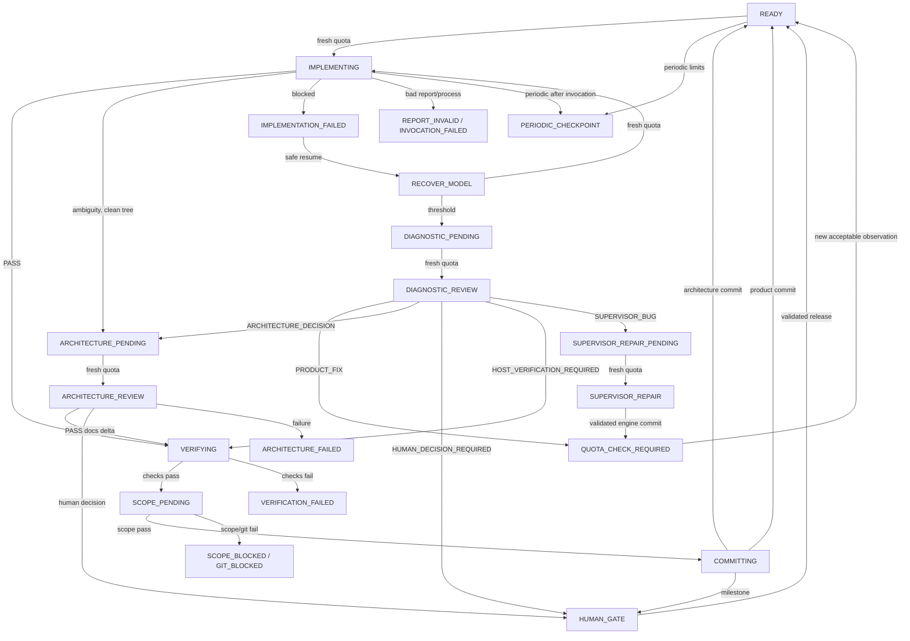

# Development Supervisor 1.x: автоматы состояний

Статус: **AS-IS** на коммите `854083f51c9aedf33ec2d9654fc67aacff84af8a`.

## Почему это несколько связанных автоматов

Поле `state.json.phase` одно, но фактическое поведение образуют четыре связанных
протокола:

1. ticket pipeline: model → verification → scope → commit;
2. quota authorization: свежее наблюдение → одноразовое consumption → новая квота;
3. gates/checkpoints: milestone, product decision, evidence и periodic stop;
4. recovery/diagnostic/repair: восстановление точного checkpoint, классификация и
   ограниченный ремонт движка.

Их нельзя без потери смысла представить простым линейным автоматом. Например,
`QUOTA_CHECK_REQUIRED` хранит `quota_resume_phase`, а `INTERRUPTED` —
`recovery_context.resume_phase`; оба состояния являются оболочкой над сохранённой
точкой другого автомата.

## Обзор переходов

Диаграмма показывает основные ветви, но не заменяет guards ниже.

## Состояния pipeline и model invocations

| Phase | Смысл | Обычный вход | Следующий безопасный шаг |
|---|---|---|---|
| `READY` | Нет активного run; текущий тикет готов к старту | init, commit, gate release | periodic guard, quota guard, implementation |
| `IMPLEMENTING` | Implementation process начат или требует reconciliation | `READY`/`RECOVER_MODEL` после consumption | обработать persisted invocation/report |
| `RECOVER_MODEL` | Сохранён bounded same-ticket recovery | blocked/interrupted/rejected protected change | diagnostic threshold либо новая quota и recovery model |
| `ARCHITECTURE_PENDING` | Нужен узкий architecture run | ambiguity, diagnostic, plan reconciliation | quota guard |
| `ARCHITECTURE_REVIEW` | Architecture process начат или требует reconciliation | `ARCHITECTURE_PENDING` | validate report; verification/scope/decision |
| `DIAGNOSTIC_PENDING` | Достигнут recovery threshold | `RECOVER_MODEL` | quota guard для diagnostic |
| `DIAGNOSTIC_REVIEW` | Read-only diagnostic process начат | `DIAGNOSTIC_PENDING` | одна из пяти закрытых классификаций |
| `SUPERVISOR_REPAIR_PENDING` | Валидирован `SUPERVISOR_BUG` | diagnostic | quota guard для repair |
| `SUPERVISOR_REPAIR` | Repair process начат в engine repo | pending | validate, test, engine-only commit либо fail closed |
| `VERIFYING` | Model PASS или допустимый host handoff | invocation/report/recovery | deterministic checks |
| `SCOPE_PENDING` | Проверки пройдены | `VERIFYING` | точная сверка файлов, protected/later-ticket guards |
| `COMMITTING` | Commit intent сохранён до Git mutation | scope PASS | создать либо reconcile единственный commit |

`IMPLEMENTING`, `ARCHITECTURE_REVIEW`, `DIAGNOSTIC_REVIEW` и
`SUPERVISOR_REPAIR` намеренно durable: после crash `resume` сначала читает artifacts,
а не запускает вторую модель. Основной цикл находится в
[supervisor.py:5627–5764](../supervisor.py#L5627-L5764).

## Quota-состояния

| Phase | Причина | Guard выхода |
|---|---|---|
| `QUOTA_CHECK_REQUIRED` | Нет snapshot, он устарел, malformed, уже consumed или repair/diagnostic требует новый | новое trusted observation с допустимым 5-hour reserve и, если задан, weekly reserve |
| `QUOTA_LOW` | Snapshot валиден, но ниже role reserve | новое наблюдение выше reserve |
| `QUOTA_EXHAUSTED` | Codex сообщил rate/usage limit | observation должен быть новее `quota_exhausted_at` и пройти обычный guard |

Во всех трёх сохраняются `quota_resume_phase` и `pending_role`. Snapshot consumed до
фактического model start, поэтому неудачный вызов также требует нового наблюдения.
Reset timestamps информационные; сами по себе они не восстанавливают authorization
([supervisor.py:289–397](../supervisor.py#L289-L397)).

## Quiescent stop/error/gate-состояния

Именно множество `TERMINAL_STATES` считается quiescent и пригодным для безопасного
отключения процесса
([supervisor.py:57–64](../supervisor.py#L57-L64)). Здесь «terminal» означает
«текущий CLI loop остановлен», а не «проект завершён».

| Phase | Смысл | Может ли обычный `resume` продолжить |
|---|---|---|
| `HUMAN_GATE` | Milestone, product decision, owner evidence или adopted architecture | Только после валидного `gate release` либо специального reconciliation |
| `PERIODIC_CHECKPOINT` | Достигнут эксплуатационный лимит | Release; plan reconciliation; architecture adoption; особый post-implementation resume |
| `VERIFICATION_FAILED` | Команда, output evidence или `git diff --check` не прошли | Да, если точный model checkpoint сохранён; host failure имеет отдельный recovery |
| `GIT_BLOCKED` | Branch/HEAD/tree/fingerprint/commit reconciliation небезопасны | Только для распознанных узких checkpoint; иначе ручная сверка |
| `SCOPE_BLOCKED` | Файлы не совпадают с report либо нарушают scope | Только для валидного protected-scope recovery; иногда resume сознательно не рекламируется |
| `REPORT_INVALID` | JSON report или его семантика невалидны | Только report-only recovery с неизменным delta |
| `INVOCATION_FAILED` | Model process завершился ошибкой | Retry/recovery только если Git checkpoint это допускает; свежая quota обязательна |
| `IMPLEMENTATION_FAILED` | Валидный implementation report не PASS | Same-ticket recovery при непротиворечивом сохранённом run |
| `ARCHITECTURE_FAILED` | Architecture report не дал допустимого результата | Автоматического специального восстановления нет |
| `INTERRUPTED` | Stop, Ctrl+C, timeout, network или межстадийное прерывание | По типу recovery context |
| `DIAGNOSTIC_FAILED` | Diagnostic evidence/report/reconciliation небезопасны | Только узкий валидируемый recovery; иначе оператор |
| `SUPERVISOR_REPAIR_FAILED` | Repair невалиден, прерван, вышел за paths или не прошёл тесты | Автоматического retry path нет |

Отдельного `COMPLETED`/`PLAN_DONE` нет. Это не пропуск диаграммы, а ограничение AS-IS.

## Guards и побочные эффекты ключевых переходов

### `READY → IMPLEMENTING`

Guards:

- Git repository, точная `expected_branch`, clean tree;
- periodic threshold не достигнут;
- ticket и authoritative documents разрешаются;
- output schema совместима с поддержанным Codex subset;
- quota snapshot валиден и атомарно consumed.

Побочные эффекты: создаётся run directory и `prompt.md`; в state сохраняется
`active_run`; до model process фиксируется phase и quota audit. Затем пишутся artifacts
и accounting.

### Model phase → `VERIFYING`

Guards: exit code 0, report соответствует schema и дополнительным инвариантам, PASS не
противоречит completion flags. Environment-blocked допускается только с сохранёнными
изменениями и policy-owned host handoff либо bounded recovery.

### `VERIFYING → SCOPE_PENDING`

Все configured checks и output-evidence rules должны пройти. Успешные результаты
сохраняются и при resume не повторяются. Независимо от policy выполняется
`git diff --check`.

### `SCOPE_PENDING → COMMITTING`

Реальные dirty paths должны точно равняться report paths. Fingerprint после model не
должен измениться во время checks. Implementation не может затрагивать protected или
явно later-ticket paths без точной авторизации. Architecture ограничена allowlist.

### `COMMITTING → READY/HUMAN_GATE/PERIODIC_CHECKPOINT`

До staging сохраняется `pending_commit`. При restart допускается только commit с
ожидаемым parent и subject. После product commit тикет добавляется в
`completed_tickets`, обновляются timing/checkpoint counters и вычисляется следующий
тикет. Для последнего тикета это вычисление AS-IS падает: состояния завершённого плана
нет.

### Architecture blocker

Implementation ambiguity с clean tree → `ARCHITECTURE_PENDING`. Architecture изменяет
только docs и получает отдельный commit, после чего текущий ticket запускается заново.
Если dirty implementation checkpoint уже существует, он fingerprint-bound, сохраняется
через architecture commit и возвращается в recovery. Genuine product decision →
`HUMAN_GATE`.

### Diagnostic и repair

Повторные завершённые recovery одного тикета → `DIAGNOSTIC_PENDING`. Diagnostic не
редактирует workspace. `SUPERVISOR_BUG` открывает только repair role; repair проверяет
неизменность product snapshot, allowlist engine-файлов, report, tests, compilation и
diff до engine-only commit. После commit необходима повторная diagnostic classification.

## Семантика команд

### `run`

Продвигает pipeline, пока:

- не попадёт в quiescent state;
- не встретит неизвестную текущему loop фазу;
- не получит stop request/interrupt;
- не выбросит `SupervisorError`, перехваченный верхним CLI уровнем.

`run` не является безусловным retry. Он всегда применяет guards текущей phase.

### `resume`

Удаляет сохранённый stop request и выбирает recovery по persisted phase. Оно может:

- reconcile уже завершившийся model call;
- продолжить verification без новой модели;
- перевести partial model work в `RECOVER_MODEL`;
- повторить quota guard;
- проверить точный protected/report/diagnostic checkpoint;
- ничего не делать, если безопасного перехода нет.

Логика: [supervisor.py:5766–5850](../supervisor.py#L5766-L5850). Dashboard рекламирует
`./dev resume` не для всех terminal states; unsafe recovery сознательно скрывается
([supervisor.py:1531–1545](../supervisor.py#L1531-L1545)).

### `stop`

Если phase уже quiescent, немедленно сообщает, что отключение безопасно. Иначе атомарно
создаёт `stop-request.json` и до ограниченного deadline ждёт, пока active child process
будет завершён и state перейдёт в `INTERRUPTED`. Если acknowledgement не получен,
команда возвращает ошибку и прямо запрещает считать остановку безопасной
([supervisor.py:6144–6168](../supervisor.py#L6144-L6168)).

## Связь phase с runtime evidence

| Phase family | Обязательное durable evidence |
|---|---|
| Model running/reconcile | `active_run.id`, run `command.json`, `events.jsonl`/`process-outcome.json`, `invocation.json`, report при наличии |
| Verification | `active_run.verification_results`, `checks.json`, check logs, model fingerprint |
| Commit | `pending_commit.starting_head`, fingerprint, role, ticket, message |
| Quota | `quota.json` observation identity/authorization и `state.quota_consumptions` |
| Human/periodic gate | `gate.kind`, HEAD, ticket, fingerprint и kind-specific поля |
| Recovery | `recovery_context.kind`, starting HEAD, fingerprint, prior run ID и preserved files |
| Diagnostic/repair | bounded evidence bundle, exact supplied run IDs, product snapshot, repair commit lineage |

Если state и artifacts противоречат друг другу, общий принцип — fail closed, а не
угадывание наиболее удобного перехода.
